# DiedricoApp
DiedricoApp es una aplicación en Android para enseñar uno de los sistemas de dibujo técnico llamada diédrico que se imparte en Bachillerato. El objetivo de la aplicación es potenciar la vista espacial del alumnado ayudándolo a ver más allá de un papel, con animaciones interactivas, con toda la materia de la asignatura, y con funciones especiales para dispositivos móviles como la visión artificial.

## Screenshots
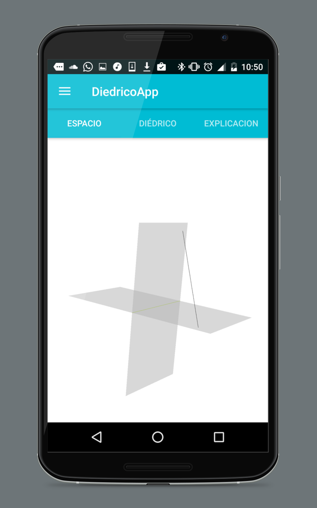 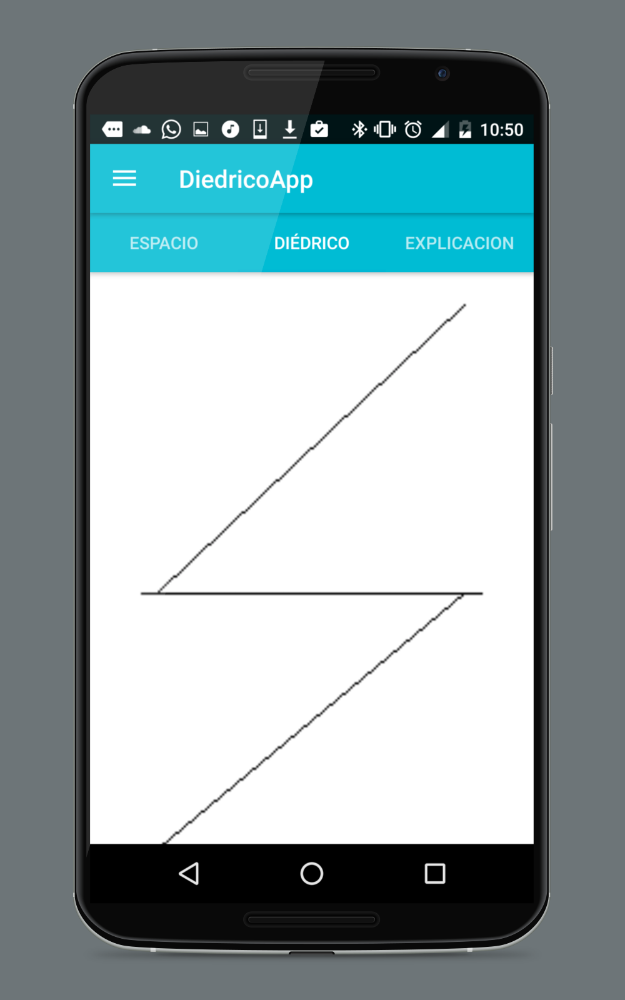 
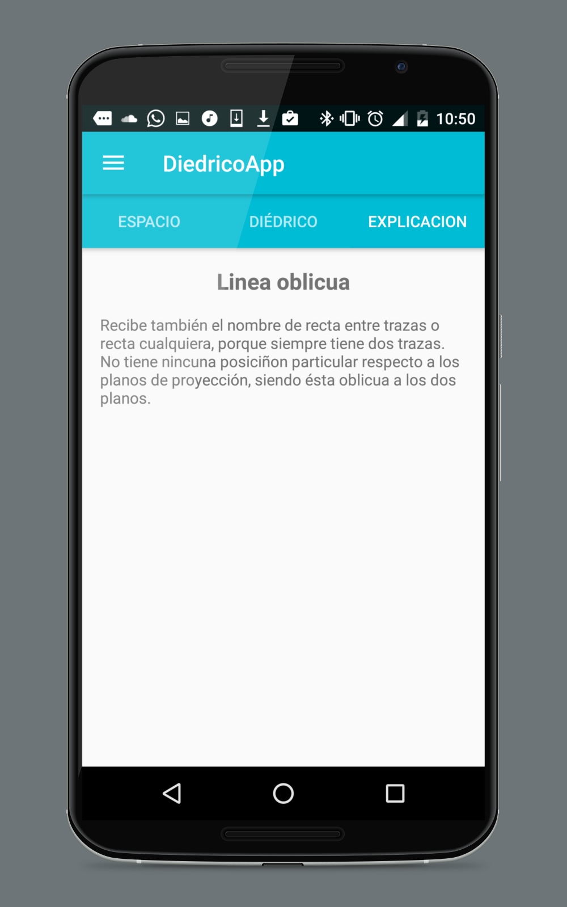 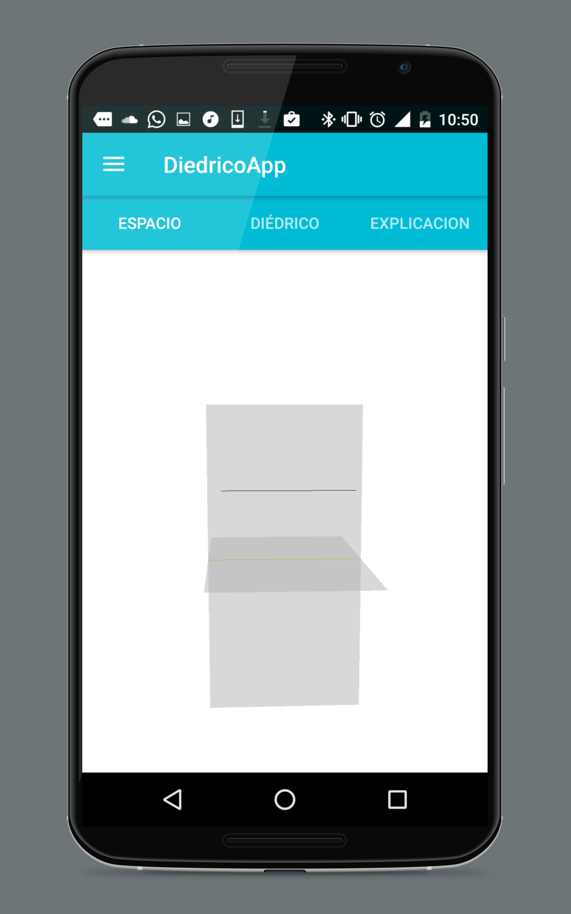  
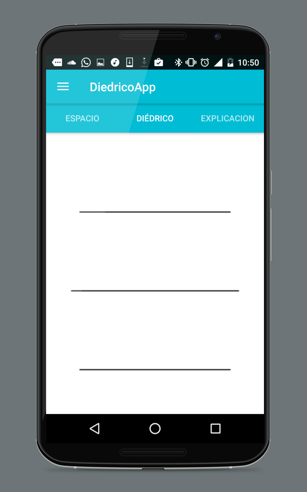 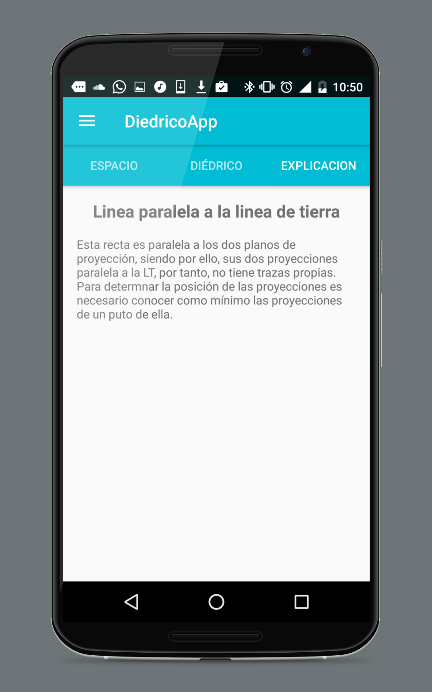
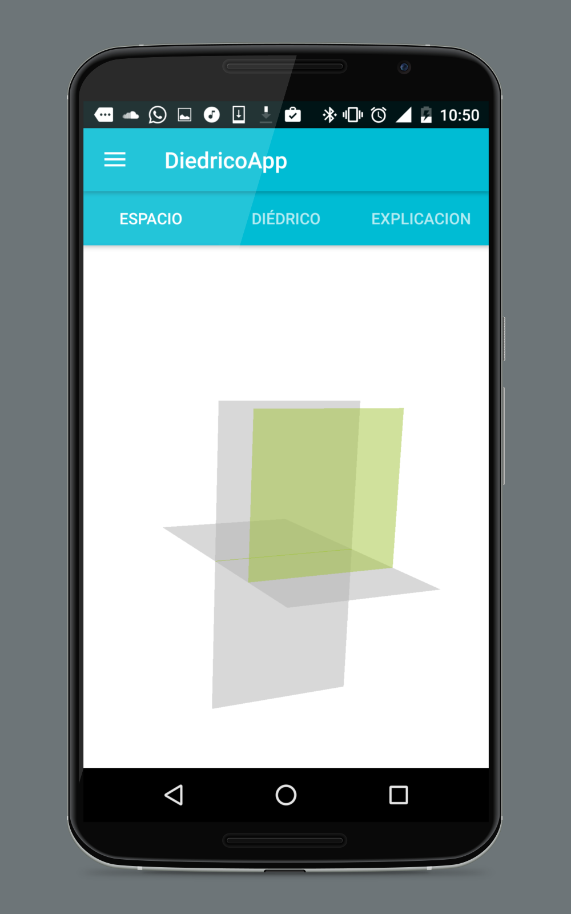 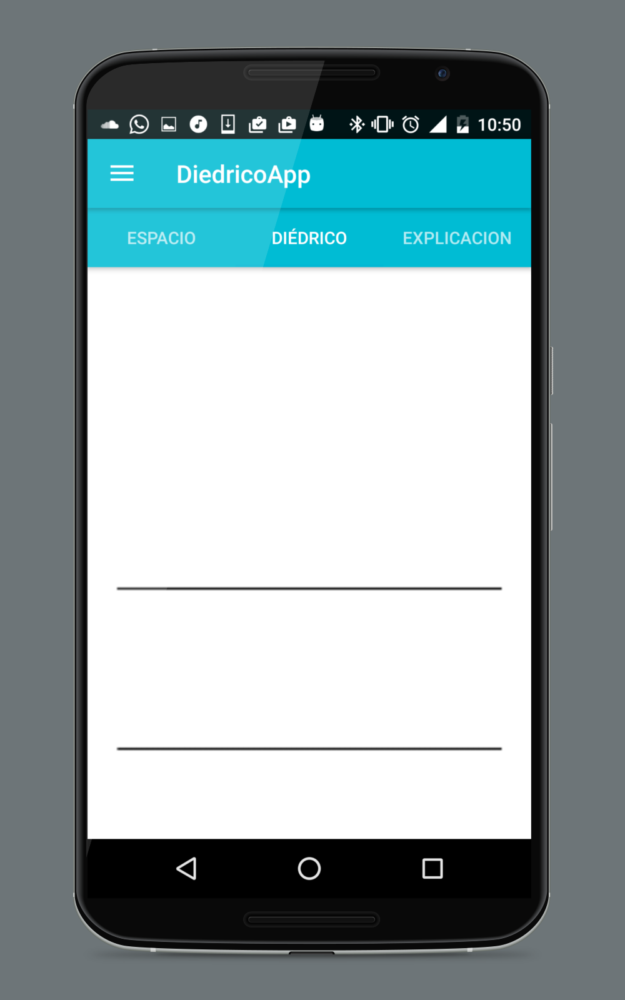
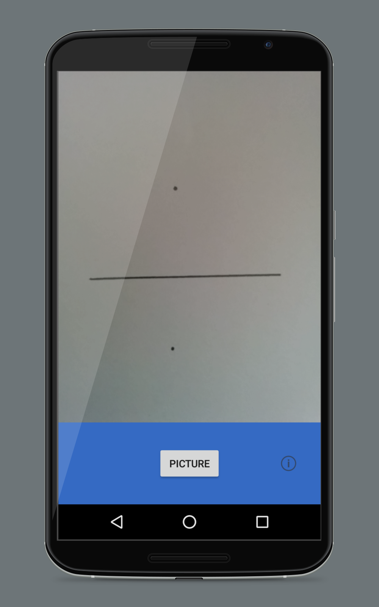 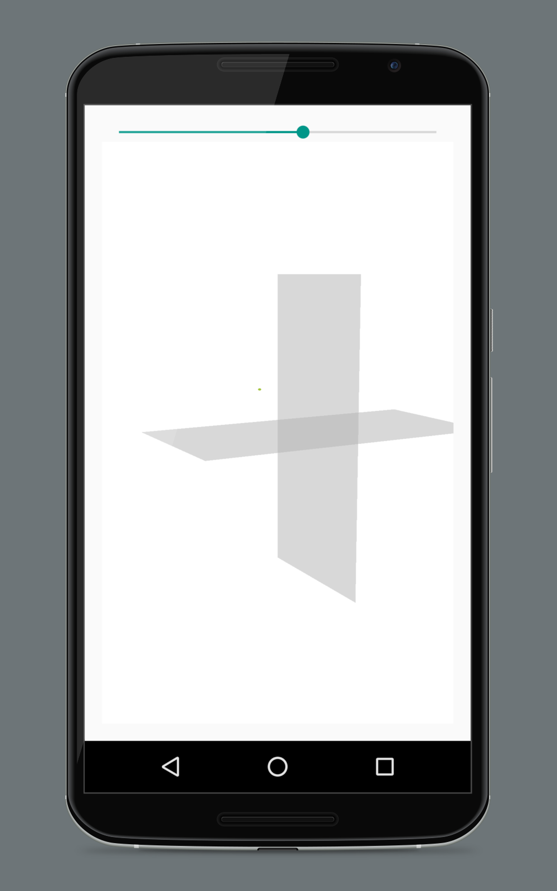 
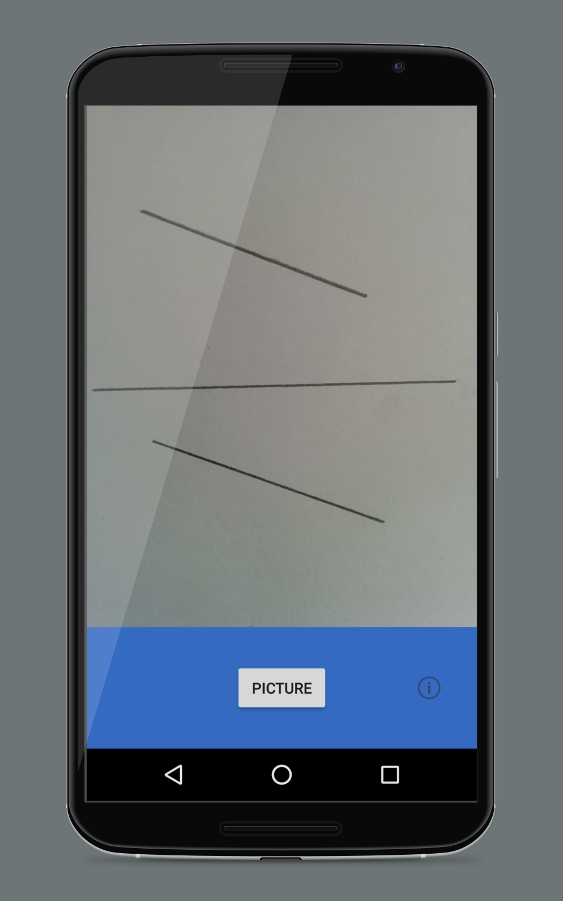 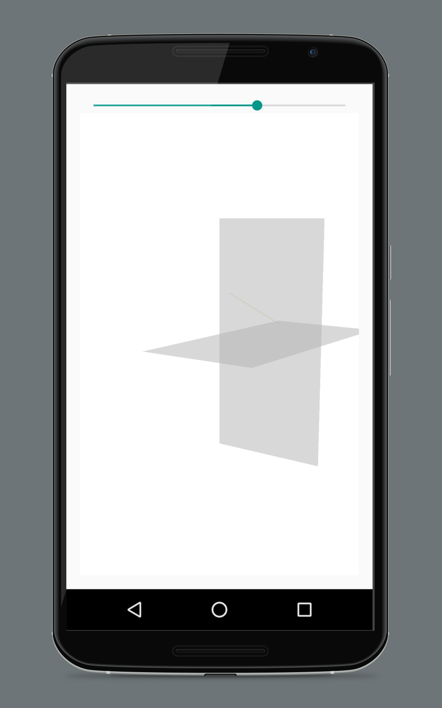  
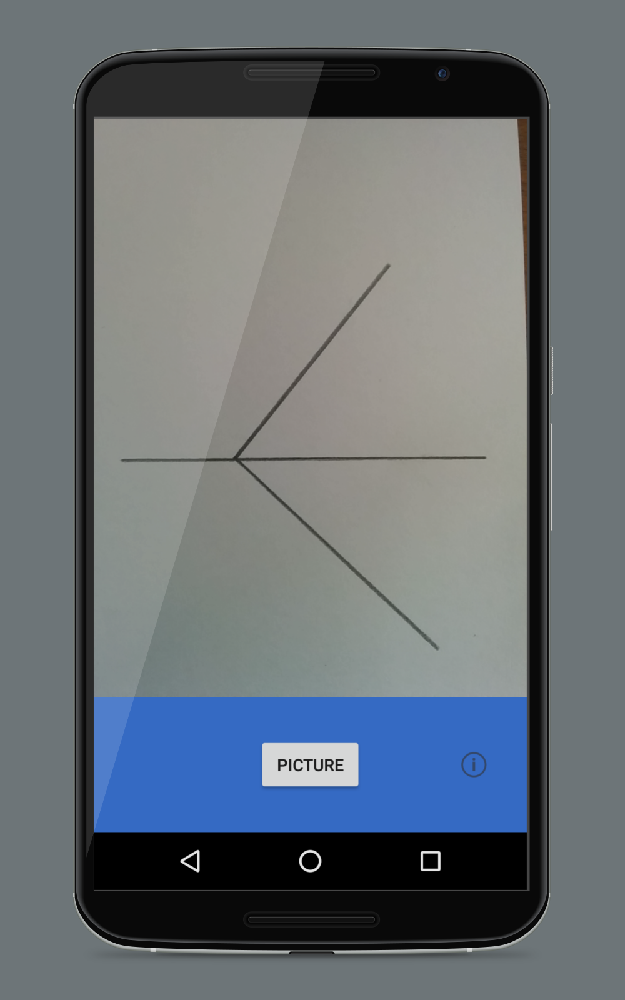 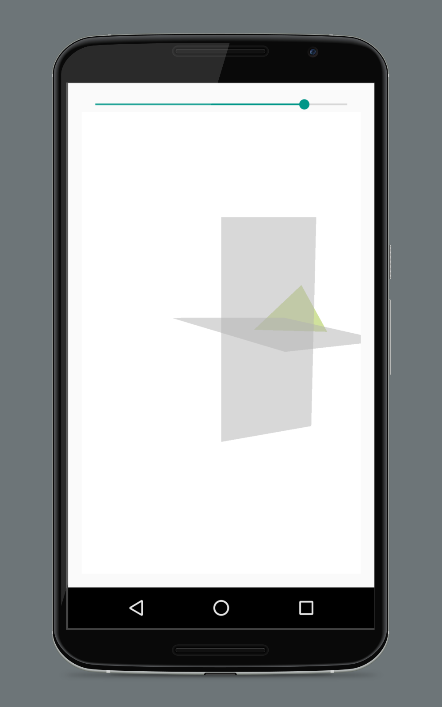
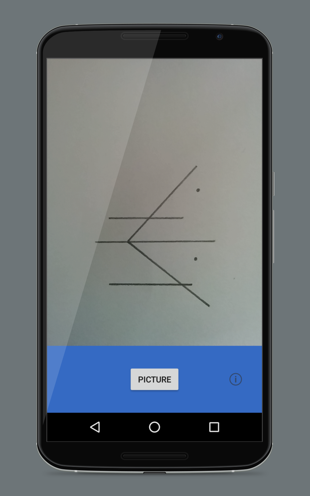 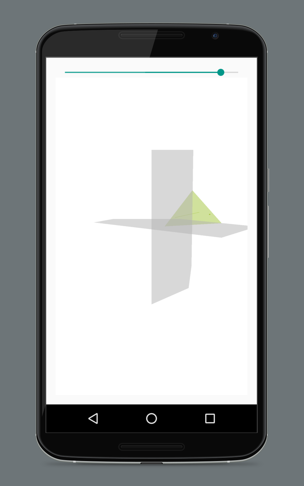

## ¿Por qué?
DiedricoApp está desarrollada por Fran Acién, estudiante Ingeniería de Computadores en la Universidad Politécnica de Madrid. El proyecto se empezó a desarrollar en 2016, cursando segundo de Bachillerato, con el objetivo de ayudar en clase a hacer los ejercicios de Dibujo Técnico, -Si el profesor no enseña enseñaré yo!-.

Con esta app se pretende ayudar a los alumnos a entender más facilmente como funciona la geometría descriptiva, incentivando el desarrollo de la visión espacial con animaciones y funciones especiales como la de hacer una foto a una lámina y pasarlo a 3D.

## Características
El proyecto se divide en dos partes:
1. Explicación de la materia de diédrico a través de animaciones y explicaciones precisas para que el alumno desarrolles su visión expacial. Tiene tres pantallas que serian: 
* Espacio: Donde están las animaciones de la proyección en cuestión.
* Diédrico: Proyección del plano en vista diédrica.
* Explicación: Una explicación del concepto que se está trabajando.
	
 

2. Reconocimiento de láminas con visión artifial, para pasar una lámina de diedrico a un sistema tridimensional. Para utilizarla solo hay que hacer una foto y directamente se pasaría a ver la lámina en 3 dimensiones.

  

## ¿Dónde descargarla?
La aplicación todavía está en proceso, aunque si eres muy impaciente puedes descargarte el proyecto y compilarlo en tu teléfono, o descargarte el binario de aquí.

## Blog del proyecto
Puedes seguir el avance de la aplicación en www.diedrico.com

## ¿Cómo funciona?
El proyecto se divide en dos partes, la parte de la explicación y, la otra, de visión artificial. Una descripción rápida de como funciona sería:

Para la explicación la clase principal es MainActivity, que es la que organiza los tres fragments de DiedricoFragment, ExplanationFragment y ProjectionFragment.

Para la visión artificial se utiliza la librería de BoofCV. La principal clase es DiedricoFragment que es la encargada de analizar la imagen, aplicar filtros para eliminar las imperfecciones y lanzar la proyección en 3 dimensiones.

Una explicación más detallada del código en el blog del proyecto, diedrico.com

## ¿Se puede contribuir?
Sí, por supuesto.

## Librerias utilizadas
Para esta aplicación se ha utilizado [BoofCV](https://github.com/lessthanoptimal/BoofCV) y [OpenGL ES](http://developer.android.com/intl/es/guide/topics/graphics/opengl.html).

## Créditos
DiedricoApp fue escrita por:
* Fran Acién

## License
This work is licensed under the terms of the GNU General Public License, version 2 or later (see
http://www.fsf.org/licensing/licenses/gpl.html). Derivative works and later
versions of the code must be free software licensed under the same or a
compatible license.

